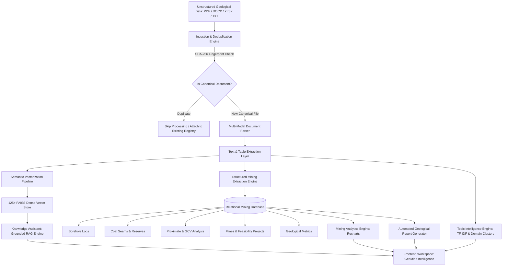

# GeoMine Intelligence — End-to-End System Workflow

**Platform:** GeoMine Intelligence (CMPDI / Coal India Limited AI Exploration & Analysis Platform)  
**Document:** System Architecture & Operational Workflow (`workflow.md`)  
**Version:** 1.2 · 2026 Production Specification  

---

## 1. High-Level Operational Architecture

GeoMine Intelligence processes heterogeneous geological exploration data—borehole core logs, coal seam stratigraphy, proximate coal quality analyses, and mining feasibility reports—transforming unstructured documentation into audit-grade, schema-validated relational data and semantic knowledge.



---

## 2. Ingestion & Deduplication Workflow

```
[User / Drag & Drop Upload]
             │
             ▼
[File Receipt & Validation]
  ├── Format Check (.pdf, .docx, .xlsx, .txt)
  └── Size & Integrity Validation
             │
             ▼
[SHA-256 Checksum Calculation]
  ├── Match found in Canonical Registry?
  │     ├── YES: Retain single canonical instance, prevent vector bloat
  │     └── NO: Register new document ID in database
             │
             ▼
[Multi-Stage Ingestion Pipeline]
  ├── Stage 1: Document Text & Metadata Extraction
  ├── Stage 2: Tabular Structure Detection & Normalization
  ├── Stage 3: Semantic Paragraph & Lithological Chunking
  └── Stage 4: Dense Vector Indexing in FAISS
             │
             ▼
[Document Intelligence Registry Updated]
```

1. **Upload Trigger:** Users drop documents into the `Document Intelligence` workspace.
2. **SHA-256 Checksumming:** A cryptographic SHA-256 hash is computed. If identical content already exists, duplicate processing is averted, preserving index purity.
3. **Parsing Engine:** Text, structured tables, and stratigraphic boundaries are extracted page by page, retaining page-level provenance.
4. **Registry Entry:** Document metadata (total pages, file size, timestamps) is committed to the relational database.

---

## 3. Grounded Retrieval-Augmented Generation (RAG) Workflow

The Knowledge Assistant provides factual answers to geological queries, strictly backed by verbatim citations.

```
[User Geological Query] (e.g., "What is the ash percentage of Seam VI in Block IV?")
             │
             ▼
[Query Preprocessing & Intent Classification]
  └── Coal terminology normalization (CMPDI grades, seam aliases)
             │
             ▼
[Dense Vector Retrieval]
  ├── Query Embedding Generation
  └── FAISS L2/Cosine Similarity Match against Canonical Vector Space
             │
             ▼
[Top-k Passage Reranking & Provenance Assembly]
  ├── Extract top matching chunks with Document ID & Page Numbers
  └── Verify verbatim evidence strings
             │
             ▼
[Context-Augmented LLM Prompting]
  ├── System Prompt: Strict adherence to supplied geological context
  └── Inject Retrieved Passages + Source Metadata
             │
             ▼
[Grounded Response Formulation]
  ├── Technical Geological Answer
  ├── Interactive Document & Page Citation Chips
  └── Expandable Source Snippet Cards
```

- **Query Latency:** Sub-second retrieval over canonical vector partitions.
- **Evidence Assurance:** Every claim displays the source document and page number. If facts are absent from the ingested corpus, the system explicitly states lack of ground truth rather than hallucinating.

---

## 4. Structured Mining Data Extraction Workflow

Structured extraction parses complex mining tables into five normalized entity schemas with complete character-level and page-level provenance.

```
[Document Selection] (Specific Ingested File OR Batch All)
             │
             ▼
[Extraction Pipeline Trigger: POST /api/v1/extract/{id}]
  ├── Borehole Parser: Collar RL, Total Depth, Lithology
  ├── Coal Seam Parser: Thickness, Seam ID, CIL Grade, Reserves MT
  ├── Proximate Analysis Parser: Moisture, Ash, VM, FC, GCV (kcal/kg)
  ├── Mining Project Parser: Mine Name, Subsidiary, Capacity, Stripping Ratio
  └── Geological Metrics Parser: Dip, Strike, Basin Classification
             │
             ▼
[Schema Validation & Provenance Enrichment]
  └── Attach { source_document, source_page, verbatim_evidence_text }
             │
             ▼
[Database Commit & Indexing]
             │
             ▼
[UI Presentation in Structured Data Workspace]
  ├── Dual Scope Filtering: "Current Document" vs "All Documents"
  ├── In-Memory Instant Tab Search & Filtering
  └── Expandable Verbatim Evidence Accordion Row
```

---

## 5. Mining Analytics & Visualization Workflow

```
[Database Mining Records]
             │
             ▼
[Aggregation & Normalization API: /api/v1/analytics/*]
  ├── Subsidiary Normalization (Maps long names to CMPDI, CCL, WCL, etc.)
  ├── Coal Grade Distribution Grouping (G1 through G17)
  ├── Depth vs. Collar Correlation Computations
  └── Overburden Stripping Ratio vs. Production Capacity
             │
             ▼
[Interactive Recharts Dashboard: MiningAnalytics.jsx]
  ├── Dynamic Y-Axis Label Renderers (Zero Text Wrapping)
  ├── Tooltip Interceptors (Displays Full Organization Name on Hover)
  ├── Cross-Filtering via Subsidiary & Category Dropdowns
  └── Direct Deep-Links to Corresponding Geological Reports
```

---

## 6. Topic Intelligence & Semantic Terminology Workflow

```
[Document Parsed Text Corpus]
             │
             ▼
[Topic Intelligence Engine: backend/app/services/topics/service.py]
  ├── Text Preprocessing & Cleaning (Stopwords, Domain Exclusions, Punctuation)
  ├── Corpus-Level & Document-Level Tokenization
  ├── TF-IDF Relevance Scoring:
  │     ├── Term Frequency (TF): Log-normalized frequency within document
  │     └── Inverse Document Frequency (IDF): Corpus-wide rarity weighting
  ├── Geological & Mining Domain Topic Classification:
  │     ├── Borehole & Stratigraphy
  │     ├── Coal Quality & Petrography
  │     ├── Reserve Estimation & Economics
  │     ├── Mining Operations & Infrastructure
  │     ├── Subsidiary & Corporate Structure
  │     └── Environmental & Safety Regulations
  └── Word Cloud Weight Calculation (Normalized 1–100 Display Range)
             │
             ▼
[Topic Intelligence Endpoints: /api/topics/*]
  ├── GET /api/topics/summary (Corpus-wide or ?document_id scoped)
  ├── GET /api/topics/word-cloud (SVG-ready weighted terms)
  └── GET /api/topics/documents/{document_id} (Per-file thematic deep dive)
             │
             ▼
[Interactive Frontend: TopicIntelligence.jsx]
  ├── SVG Word Cloud with Golden Angle Spiral Radial Distribution
  ├── Topic Cards with Animated Relevance Gauges & Provenance Drilldown
  ├── Scoped Filtering (All Documents vs. Current Document)
  └── Keyword Intelligence Data Table with TF-IDF Relevance Bars
```

---

## 7. Kinematics, UI State & Interaction Workflow

```
[App Mount: App.jsx]
  ├── 1. Initialize Lenis Smooth Scroll Engine (services/motion.js)
  ├── 2. Auto-Detect OS Color Scheme & Load Stored Theme (Light Coffee / Dark Espresso)
  ├── 3. Fire Health Telemetry Poller (GET /api/v1/health every 30s)
  └── 4. Subscribe Window Listeners & Smooth Scroll Event Loop
             │
             ▼
[Navigation Tab Select: Sidebar.jsx]
  ├── Update activeTab State in App.jsx
  ├── Trigger GSAP animatePageEntrance (fade-up stagger on content container)
  └── Mount Selected Workspace View (Lazy/Dynamic)
             │
             ▼
[User Viewport Interaction]
  ├── Lenis Virtual Scroll intercepts wheel & touch for smooth momentum
  └── Micro-interactions: Cards lift by -2px with umber shadow depth transitions
```

---

## 8. User Personas & Workflows

### Persona A: Exploration Geologist
1. Ingests raw borehole drilling lithology PDFs via **Document Intelligence**.
2. Verifies that SHA-256 deduplication correctly links existing records without duplicate vector creation.
3. Reviews extracted **Borehole Logs** and **Coal Seams** in **Structured Data**, opening the *Verbatim Evidence* accordion to verify reported seam thicknesses against the original PDF scan.
4. Explores dominant lithological terminology and seam clusters in **Topic Intelligence**.

### Persona B: Mine Planning & Feasibility Engineer
1. Queries the **Knowledge Assistant** to locate proximate analysis parameters (Ash %, Moisture %, GCV) for specific seams across exploration blocks.
2. Clicks source citation chips to open the exact page reference.
3. Analyzes stripping ratios and target production (MTPA) in **Mining Analytics** to benchmark opencast vs. underground feasibility.
4. Identifies thematic patterns across multiple mine feasibility reports via **Topic Intelligence**.

### Persona C: CMPDI / CIL Executive & General Manager
1. Inspects **Platform Overview** telemetry to verify total ingested exploratory assets and pipeline status.
2. Evaluates the **Mine Projects by Subsidiary** chart to assess project allocation across subsidiaries (CMPDI, CCL, WCL, BCCL, ECL, SECL, MCL, NCL).
3. Inspects corporate and subsidiary thematic keyword clusters in **Topic Intelligence**.
4. Exports technical summary reports via **Geological Reports** for ministerial review.
